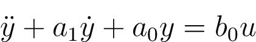

# MAE171B-final-project

Designing a state-observer model controller for a system

The system is supposed to describe a linearized model of an inverted pendulum.

In this case, both poles of the plant are real.
